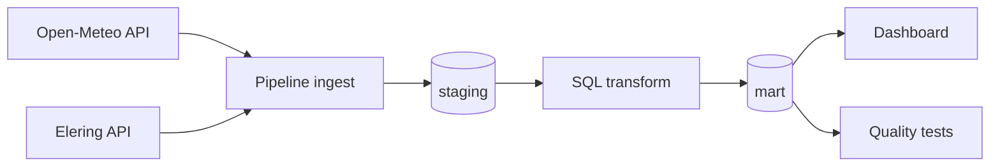

# Elektritarbimise optimeerimine kasvuhoones (Greenhouse Energy Optimization)

## Projekti eesmärk
Selle projekti eesmärk on analüüsida, millal tasub kasvuhoones kasutada elektrit nõudvaid seadmeid (küte, ventilatsioon), et vähendada elektrikulusid börsihinnaga elektrilepingu korral.

## Äriküsimus
Millistel tundidel tasub kasvuhoones kasutada elektrit nõudvaid seadmeid (küte, ventilatsioon), et vähendada elektrikulu börsihinna tingimustes, arvestades välistemperatuuri?

---

## Projekti allikas ja töörepo

- Kursuse juhised ja näidismaterjalid pärinevad repost: `https://github.com/KristoR/ut-andmeinseneeria-2026`
- Aktiivne töö toimub selles repos: `https://github.com/sirja-hass/Elektritarbimise_optimeerimine_kasvuhoones`

Projekt kasutab elektri börsihindu ja ilmaandmeid, et leida soodsaimad ajad elektri tarbimiseks.

---

## Projekti ulatus

Projekt on tehtud kursuse **UT andmeinseneeria 2026** projektitöö nõuete järgi ning katab otsast lõpuni andmetöövoo:

1. Andmete sissevõtt (ingest)
2. Transformatsioon
3. Andmekvaliteedi testid
4. Dashboard

---

## Lihtsustusmudel

Kuna sisetemperatuuri sensorit ei kasutata, lähtume baastaseme hinnangust:

```text
hinnanguline_sisetemp = välistemp + 5°C
```

Juhtimisreeglid:

- kui `hinnanguline_sisetemp < 12°C` → küte vajalik
- kui `hinnanguline_sisetemp > 28°C` → ventilatsioon vajalik
- muidu → temperatuur sobiv

Arvesse võetakse:

- elektri börsihind
- välistemperatuur

Mudelit kasutatakse demonstratsiooniks ning tegemist ei ole täpse agronoomilise simulatsiooniga.

---

## Andmeallikad

Projekt modelleerib kasvuhoone otsuseid 5 Eesti asukoha põhjal:

- Tallinn
- Tartu
- Pärnu
- Kohtla-Järve
- Kuressaare

Põhiandmeallikad:

- **Open-Meteo Forecast API** – välistemperatuur ja tunniandmed
- **Elering NPS API** (`/api/nps/price`) – elektri börsihind tunni kaupa

Oluline piirang:

Eleringi day-ahead hinnad on otsustamiseks usaldusväärselt kättesaadavad peamiselt tänase ja homse kohta, seetõttu kasutatakse lühikest otsustusakent:

```text
FORECAST_DAYS=2
```

---

## KPI-d / küsimused dashboardil

1. Kütte- ja ventilatsioonitundide arv päevas
2. Keskmine elektrihind reeglipõhise kasutuse tundidel võrreldes päeva keskmise hinnaga
3. Hinnanguline päevane elektrikulu reeglipõhises kasutuses vs pidev kasutus

---

## Tehnoloogiad

- Python
- PostgreSQL / Supabase
- SQL
- Docker
- cron
- GitHub
- Metabase / Power BI

---

## Tehniline voog



---

## Planeeritud töövoog

1. Python script küsib API-dest andmed
2. Andmed salvestatakse PostgreSQL andmebaasi
3. SQL transformatsioon valmistab andmed analüüsiks ette
4. Dashboard kuvab soovitused ja hinnainfo
5. cron käivitab andmete uuendamise automaatselt

---

## Minimaalne kaustastruktuur

```text
.
├── dashboard/
│   └── app.py
├── docs/
│   ├── arhitektuur.md
│   └── progress.md
├── init/
│   └── 01_create_objects.sql
├── scripts/
│   ├── 00_seed_dimensions.sql
│   ├── 01_transform.sql
│   ├── 02_quality_tests.sql
│   ├── run_pipeline.py
│   └── start_cron.sh
├── .env.example
├── compose.yml
├── requirements.txt
└── README.md
```

---

## Käivitamine

```bash
cp .env.example .env
docker compose up -d --build
docker compose exec pipeline python scripts/run_pipeline.py run-all
docker compose exec pipeline python scripts/run_pipeline.py check
```

Scheduleri logid:

```bash
docker compose logs -f scheduler
```

Dashboard:

```text
http://localhost:8501
```

---

## Projekti struktuur

```text
docs/           dokumentatsioon
scripts/        Python töövoog
dashboard/      visualiseerimine
init/           andmebaasi objektid
```

---

## Meeskond

Rollide jaotus on kirjeldatud failis:

```text
docs/arhitektuur.md
```
1. Sirja Hass
2. Ave Kaare
3. Piret Sults
4. Kätlin Pendarov


