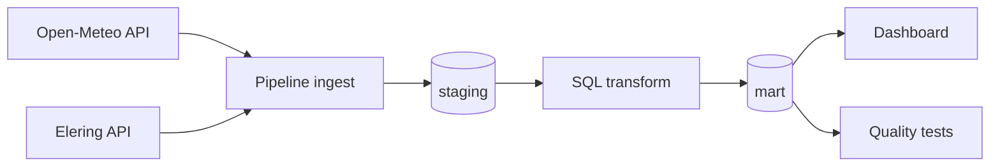

# Elektritarbimise optimeerimine kasvuhoones (Greenhouse Energy Optimization)

## Projekti eesmärk
Selle projekti eesmärk on analüüsida, millal tasub kasvuhoones kasutada elektrit nõudvaid seadmeid (küte, ventilatsioon), et vähendada elektrikulusid börsihinnaga elektrilepingu korral.

## Äriküsimus
Millistel tundidel tasub kasvuhoones kasutada elektrit nõudvaid seadmeid (küte, ventilatsioon), et vähendada elektrikulu börsihinna tingimustes, arvestades välistemperatuuri?

---

## Projekti allikas ja töörepo

- Kursuse juhised ja näidismaterjalid pärinevad repost: `https://github.com/KristoR/ut-andmeinseneeria-2026`
- Aktiivne töö toimub selles repos: `https://github.com/sirja-hass/Elektritarbimise_optimeerimine_kasvuhoones`

Projekt kasutab elektri börsihindu ja ilmaandmeid, et leida soodsaimad ajad elektri tarbimiseks.

---

## Projekti ulatus

Projekt on tehtud kursuse **UT andmeinseneeria 2026** projektitöö nõuete järgi katab tervikliku andmetöövoo alates andmete kogumisest kuni visualiseerimiseni.

1. Andmete sissevõtt (ingest) Open-Meteo Forecast API-st ja Elering NPS API-st.
2. Andmete transformatsioon, mille käigus arvutatakse hinnanguline kasvuhoone sisetemperatuur, energiavajadus ning elektrikulu näitajad.
3. Andmekvaliteedi testid, mis kontrollivad lähteandmete olemasolu, korrektsust ja transformatsioonide tulemusi.
4. Streamlit Dashboard, mis kuvab KPI-d ja visualiseeringud kasvuhoone energiavajaduse ning elektrikulude kohta.
5. Automatiseeritud töövoog, kus cron scheduler käivitab andmete uuendamise regulaarselt.

---

## Lihtsustusmudel

Kuna sisetemperatuuri sensorit ei kasutata, lähtume baastaseme hinnangust:

```text
hinnanguline_sisetemp = välistemp + 5°C
```

Juhtimisreeglid:

- kui `hinnanguline_sisetemp < 12°C` → küte vajalik
- kui `hinnanguline_sisetemp > 28°C` → ventilatsioon vajalik
- muidu → temperatuur sobiv

Arvesse võetakse:

- elektri börsihind
- välistemperatuur

Mudelit kasutatakse demonstratsiooniks ning tegemist ei ole täpse agronoomilise simulatsiooniga.

---

## Andmekvaliteedi testid

Projekt sisaldab automatiseeritud andmekvaliteedi teste, mis käivitatakse pärast andmete laadimist ja transformatsioone. Testide tulemused salvestatakse tabelisse `quality.test_results`.

| Test | Eesmärk |
|--------|--------|
| dim_location_has_active_rows | Vähemalt üks aktiivne asukoht on olemas |
| active_locations_have_coordinates | Aktiivsetel asukohtadel on korrektsed koordinaadid |
| weather_raw_has_rows | Viimases laadimises on toorandmeid |
| weather_raw_has_all_active_locations | Kõigi aktiivsete asukohtade kohta on andmed olemas |
| weather_raw_has_forecast_time | Prognoosiaeg ei ole tühi |
| unique_location_time_per_run | Duplikaatkirjed puuduvad |
| temperature_reasonable | Temperatuur jääb mõistlikku vahemikku |
| price_coverage_exists | Elektrihinna andmed on olemas |
| mart_fact_has_rows | Faktitabel sisaldab andmeid |
| action_values_valid | `action_needed` sisaldab ainult lubatud väärtusi |
| action_and_label_consistent | Tegevus ja kirjeldus on omavahel kooskõlas |
| combined_score_in_range | Arvutatud skoor jääb lubatud vahemikku |
| mart_daily_summary_has_rows | Päevakoondtabel sisaldab andmeid |
| latest_pipeline_success | Viimane pipeline jooks lõppes edukalt |

Viimases kontrollis läbisid kõik testid edukalt (`failed_tests = 0`).

---

## Andmeallikad

Projekt modelleerib kasvuhoone otsuseid 5 Eesti asukoha põhjal:

- Tallinn
- Tartu
- Pärnu
- Kohtla-Järve
- Kuressaare

Põhiandmeallikad:

- **Open-Meteo Forecast API** – tunnipõhine välistemperatuuri prognoos
- **Elering NPS API** – tunnipõhine elektri spot-hind Eestis

Oluline piirang:

Eleringi day-ahead hinnad on otsustamiseks usaldusväärselt kättesaadavad peamiselt tänase ja homse kohta, seetõttu kasutatakse lühikest otsustusakent:

```text
FORECAST_DAYS=2
```

---

## KPI-d / küsimused dashboardil

1. Kütte- ja ventilatsioonitundide arv päevas
2. Keskmine elektrihind reeglipõhise kasutuse tundidel võrreldes päeva keskmise hinnaga
3. Hinnanguline päevane elektrikulu reeglipõhises kasutuses vs pidev kasutus

---

## Tehnoloogiad

- Dashboard: Python + Streamlit + Altair
- Andmebaas: PostgreSQL
- Andmetöötlus: Python + SQL
- Konteinerid ja ajastus: Docker + cron
- Versioonihaldus: GitHub

---

## Tehniline voog



---

## Planeeritud töövoog

1. Python script küsib API-dest andmed
2. Andmed salvestatakse PostgreSQL andmebaasi
3. SQL transformatsioon valmistab andmed analüüsiks ette
4. Dashboard kuvab soovitused ja hinnainfo
5. cron käivitab andmete uuendamise automaatselt

---

## Projekti kaustastruktuur

```text
.
├── dashboard/
│   └── app.py
├── docs/
│   ├── arhitektuur.md
│   └── progress.md
├── init/
│   └── 01_create_objects.sql
├── scripts/
│   ├── 00_seed_dimensions.sql
│   ├── 01_transform.sql
│   ├── 02_quality_tests.sql
│   ├── 03_check_results.sql
│   ├── requirements.txt
│   ├── run_pipeline.py
│   └── start_cron.sh
├── .env.example
├── .gitignore
├── Dockerfile.app
├── README.md
└── compose.yml
```

---

## Käivitamine

```bash
cp .env.example .env
docker compose up -d --build
docker compose exec pipeline python scripts/run_pipeline.py run-all
docker compose exec pipeline python scripts/run_pipeline.py check
```

Scheduleri logid:

```bash
docker compose logs -f scheduler
```

Dashboard:

```text
http://localhost:8501
```

---

## Projekti struktuur

```text
docs/           dokumentatsioon
scripts/        Python töövoog
dashboard/      visualiseerimine
init/           andmebaasi objektid
```

---

## Meeskond

Rollide jaotus on kirjeldatud failis:

```text
docs/arhitektuur.md
```
1. Sirja Hass
2. Piret Sults
3. Ave Kaare
5. Kätlin Pendarov

---

## Kokkuvõte, puudused ja võimalikud edasiarendused

Kokkuvõttes valmis projekti käigus täielik andmetöövoog kasvuhoone elektritarbimise optimeerimise hindamiseks. Valmis said:

- Open-Meteo Forecast API ja Elering NPS API andmete automaatne sissevõtt.
- PostgreSQL andmebaasi staging- ja mart-kihi andmemudel.
- SQL transformatsioonid, mis arvutavad hinnangulise sisetemperatuuri, energiavajaduse ning elektrikulud.
- 14 automatiseeritud andmekvaliteedi testi.
- Streamlit dashboard kolme peamise KPI-ga.
- Docker Compose keskkond koos scheduleriga.
- Cron-põhine automaatne andmete uuendamine.
- Projekti dokumentatsioon ja käivitusjuhised.

Puudused:

- Kasvuhoone sisetemperatuuri hinnatakse lihtsustatud mudeliga (välistemperatuur + 5°C), mitte tegelike sensoriandmete põhjal.
- Küte ja ventilatsioon on modelleeritud lihtsustatud loogikaga ega arvesta seadmete erinevat võimsust või töörežiime.
- Elektrikulu arvutustes kasutatakse fikseeritud energiatarbimise eeldust (5 kWh tunnis).
- Eleringi day-ahead hinnad ei kata alati kogu ilmaennustuse perioodi, mistõttu kasutatakse ainult neid ridu, mille jaoks on elektrihind olemas.
- Dashboard keskendub peamiselt päevataseme KPI-dele ning ei sisalda detailsemaid analüütilisi vaateid.

Mis edasi? Kui projekti edasi arendada, võiks:

- kasutada päris kasvuhoone sensoriandmeid sisetemperatuuri hindamise asemel;
- lisada niiskuse, päikesekiirguse ja muude keskkonnanäitajate mõju;
- luua täpsema energiatarbimise mudeli erinevate seadmete jaoks;
- lisada rohkem filtreid ja võrdlusvaateid dashboardile;
- lisada automaatsed teavitused kõrge elektrihinna või suure energiavajaduse korral;
- kasutada pikemaajalisi prognoose ja ajaloolisi andmeid trendide analüüsimiseks.

