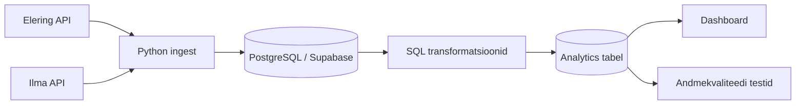

# Elektritarbimise optimeerimine kasvuhoones

## Äriküsimus

Millistel tundidel tasub kasvuhoones kasutada elektrit nõudvaid seadmeid (küte, ventilatsioon), et vähendada elektrikulu börsihinna tingimustes, arvestades välistemperatuuri?

---

## Projekti allikas ja töörepo

- Kursuse juhised ja näidismaterjalid pärinevad repost: `https://github.com/KristoR/ut-andmeinseneeria-2026`
- Aktiivne töörepo: `https://github.com/sirja-hass/Elektritarbimise_optimeerimine_kasvuhoones`

See projekt on tehtud kursuse **UT andmeinseneeria 2026** projektitöö nõuete järgi ning sisaldab:
1. andmete sissevõttu,
2. transformatsiooni,
3. andmekvaliteedi teste,
4. dashboardi.

---

## Projekti eesmärk

Projekti eesmärk on analüüsida, millal on kasvuhoones kõige mõistlikum kasutada elektrit nõudvaid seadmeid, et vähendada elektrikulusid börsihinnaga elektrilepingu korral.

Projekt kasutab:
- elektri spot-hindu,
- välistemperatuuri andmeid,
- lihtsustatud kasvuhoone temperatuurimudelit.

---

## Lihtsustusmudel

Kuna projektis ei kasutata päris kasvuhoone sisetemperatuuri sensorit, arvutatakse hinnanguline sisetemperatuur välistemperatuuri põhjal.

### Hinnanguline sisetemperatuur

```text
hinnanguline_sisetemp = välistemp + 5°C
```

### Juhtimisreeglid

- kui `hinnanguline_sisetemp < 12°C` → **küte vajalik**
- kui `hinnanguline_sisetemp > 28°C` → **ventilatsioon vajalik**
- muidu → **temperatuur sobiv**

Mudelit kasutatakse demonstratsiooniks ning tegemist ei ole täpse agronoomilise simulatsiooniga.

---

## KPI-d / küsimused dashboardil

1. Soovitatud tunnid kütte ja ventilatsiooni kasutamiseks
2. Millised on odavaimad tunnid vajalike seadmete käitamiseks
3. Päevane hinnanguline energiakulu (€), kui järgida soovitusreegleid

---

## Andmeallikad

### Elektri spot-hind
- Elering / Nord Pool API
- tunnipõhine
- ajas muutuv põhiandmeallikas

### Ilmaandmed
- Ilmateenistuse API
- välistemperatuur
- tunnipõhine
- ajas muutuv põhiandmeallikas

### Staatilised kõrvalandmed
- seadmete hinnanguline võimsustarve
- kasutatakse energiakulu arvutamiseks

---

## Tehnoloogiad

- Python
- PostgreSQL / Supabase
- SQL
- cron
- GitHub
- Metabase / Power BI

---

## Planeeritud töövoog

1. Python script küsib API-dest elektrihinna ja ilmaandmed
2. Andmed salvestatakse PostgreSQL / Supabase andmebaasi
3. SQL transformatsioonid ühendavad tunniandmed
4. Rakendatakse temperatuuripõhised soovitusreeglid
5. Dashboard kuvab KPI-d ja soovitused
6. cron käivitab andmete uuendamise automaatselt

---

## Arhitektuur



---

## Minimaalne kaustastruktuur

```text
.
├── docs/
│   ├── arhitektuur.md
│   └── progress.md
├── scripts/
├── sql/
├── tests/
└── README.md
```

---

## Andmekvaliteedi testid

Projektis kasutatakse vähemalt järgmisi teste:

- elektrihind ei tohi olla NULL
- temperatuur peab jääma mõistlikku vahemikku
- tunnikirjed peavad olema unikaalsed

---

## Käivituse üldskeem

1. Sea `.env` fail API võtmetega
2. Käivita ingest-skriptid
3. Käivita SQL transformatsioonid
4. Käivita andmekvaliteedi testid
5. Uuenda dashboardi andmemudel

---

## Riskid

1. API katkestused või päringupiirangud
2. Ajavööndite vastuolu (UTC vs Europe/Tallinn)
3. Vigased või puuduvad tunniandmed API-st

---

## Meeskond

Projekt on planeeritud 4-liikmelisele grupile. Rollid jaotusena on kirjeldatud failis `docs/arhitektuur.md`.
