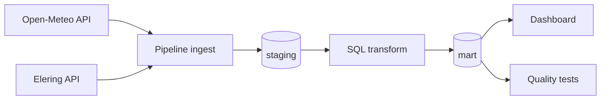

# Elektritarbimise_optimeerimine_kasvuhoones
Millistel tundidel on kasvuhoones kõige mõistlikum kasutada elektrit nõudvaid seadmeid, et börsihinnaga lepingu korral kulusid vähendada, arvestades ilmaolusid?
# Greenhouse Energy Optimization

## Projekti eesmärk
## Äriküsimus
Millistel tundidel tasub kasvuhoones kasutada elektrit nõudvaid seadmeid (küte, ventilatsioon), et vähendada elektrikulu börsihinna tingimustes, arvestades välistemperatuuri?

Selle projekti eesmärk on analüüsida, millal tasub kasvuhoones kasutada elektrit nõudvaid seadmeid (küte, ventilatsioon), et vähendada elektrikulusid börsihinnaga elektrilepingu korral.
## Projekti allikas ja töörepo
- Kursuse juhised ja näidismaterjalid pärinevad repost: `https://github.com/KristoR/ut-andmeinseneeria-2026`.
- Aktiivne töö käib selles repos: `https://github.com/sirja-hass/Elektritarbimise_optimeerimine_kasvuhoones`.

Projekt kasutab elektri börsihindu ja ilmaandmeid, et leida soodsaimad ajad elektri tarbimiseks.
## Projekti ulatus
Projekt on tehtud kursuse **UT andmeinseneeria 2026** projektitöö nõuete järgi ning katab otsast-lõpuni andmetöövoo:
1. andmete sissevõtt,
2. transformatsioon,
3. andmekvaliteedi testid,
4. dashboard.

## Äriküsimus
## Lihtsustusmudel
Kuna sisetemperatuuri sensorit ei kasutata, lähtume baastaseme hinnangust:

- `hinnanguline_sisetemp = välistemp + 5°C`

Millal on kõige soodsam kasutada kasvuhoones:
- kütet
- ventilatsiooni
Juhtimisreeglid:
- kui `hinnanguline_sisetemp < 12°C` → **küte vajalik**,
- kui `hinnanguline_sisetemp > 28°C` → **ventilatsioon vajalik**,
- muidu → **temperatuur sobiv**.

arvestades:
- elektri börsihinda
- välistemperatuuri
- päikesekiirgust
Mudelit kasutatakse demonstratsiooniks ning tegemist ei ole täpse agronoomilise simulatsiooniga.

## Andmeallikad
## KPI-d / küsimused dashboardil
1. Soovitatud tunnid kütte ja ventilatsiooni kasutamiseks.
2. Millised on odavaimad tunnid, mil vajalikku seadet käitada?
3. Päevane hinnanguline energiakulu (€), kui järgida soovitusreegleid.

### Elektrihinnad
- Elering API
## Andmeallikad ja ulatus
Selles projektis modelleerime kasvuhoone otsuseid piirkondliku ilma põhjal mitmes Eesti asulas.
Asukohad tabelis `mart.dim_location` esindavad eri piirkondades tegutsevaid kasvuhoone omanikke, et võrrelda kütte- ja ventilatsioonivajadust ning börsihinna mõju üle Eesti.

### Ilmaandmed
- Ilmateenistuse API
Põhiandmeallikad:
- **Open-Meteo Forecast API** (välistemperatuur ja tunniandmed),
- **Elering NPS API** (`/api/nps/price`, börsihind tunni kaupa).

## Tehnoloogiad
Oluline piirang: Eleringi day-ahead hinnad on otsustamiseks usaldusväärselt kättesaadavad peamiselt tänase ja homse kohta, seega kasutame lühikest otsustusakent (`FORECAST_DAYS=2`).

- Python
- PostgreSQL / Supabase
- SQL
- cron
- GitHub
- Metabase / Power BI
## Tehniline voog


## Planeeritud töövoog
## Minimaalne kaustastruktuur
```text
.
├── dashboard/
│   └── app.py
├── docs/
│   ├── arhitektuur.md
│   └── progress.md
├── init/
│   └── 01_create_objects.sql
├── scripts/
│   ├── 00_seed_dimensions.sql
│   ├── 01_transform.sql
│   ├── 02_quality_tests.sql
│   ├── 03_check_results.sql
│   ├── run_pipeline.py
│   └── start_cron.sh
├── .env.example
├── compose.yml
└── README.md
```

1. Python script küsib API-dest andmed
2. Andmed salvestatakse PostgreSQL andmebaasi
3. SQL päringud valmistavad andmed analüüsiks ette
4. Dashboard kuvab soovitused ja hinnainfo
5. cron käivitab andmete uuendamise automaatselt
## Käivitamine
```bash
cp .env.example .env
docker compose up -d --build
docker compose exec pipeline python scripts/run_pipeline.py run-all
docker compose exec pipeline python scripts/run_pipeline.py check
```

## Projekti struktuur
Scheduleri logid:
```bash
docker compose logs -f scheduler
```

```text
docs/           dokumentatsioon
scripts/        Python scriptid
sql/            SQL päringud
dashboard/      visualiseeringud
Dashboard:
- http://localhost:8501

## Meeskond
Projekt on planeeritud 4-liikmelisele grupile. Rollid jaotusena on kirjeldatud failis `docs/arhitektuur.md`.


