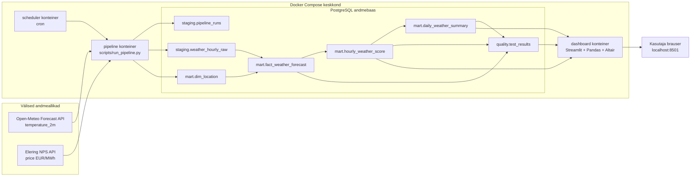

# Arhitektuur ja planeerimine

## Reposid
- Kursuse infoallikas: `https://github.com/KristoR/ut-andmeinseneeria-2026`
- Projekti töörepo: `https://github.com/sirja-hass/Elektritarbimise_optimeerimine_kasvuhoones`

## 1) Äriküsimus
Millistel tundidel on kasvuhoones vaja kasutada elektrit nõudvaid seadmeid (küte ja ventilatsioon), arvestades hinnangulist sisetemperatuuri, ning kui palju väiksem on hinnanguline elektrikulu võrreldes olukorraga, kus seade töötaks kogu päeva jooksul pidevalt?

## 2) Mõõdikud ja arvutusloogika
1. **Kütte- ja ventilatsioonitundide arv päevas**
   Iga tunni kohta arvutatakse `estimated_inside_temp_c = temperature_c + 5`. Kui hinnanguline sisetemperatuur on alla 12 kraadi, on tegevus `heating`; kui üle 28 kraadi, on tegevus `ventilation`; muul juhul on tegevus `none`. Päevane mõõdik summeerib kütte- ja ventilatsioonitunnid.

2. **Keskmine elektrihind reeglipõhise kasutuse tundidel võrreldes päeva keskmise hinnaga**
   Arvutatakse nende tundide keskmine hind, kus küte või ventilatsioon oli vajalik. Seda võrreldakse sama päeva kõigi olemasoleva hinnaga tundide keskmise elektrihinnaga.

3. **Hinnanguline päevane elektrikulu reeglipõhises kasutuses vs pidev kasutus**
   Reeglipõhise kasutuse korral eeldatakse, et seade töötab ainult tundidel, kus `action_needed` on `heating` või `ventilation`. Pideva kasutuse võrdluses eeldatakse, et seade töötaks kõigil päeva tundidel. Tunnikulu arvutatakse valemiga `tarbimine_kwh * price_eur_kwh`. Sääst on pideva kasutuse kulu miinus reeglipõhine kulu.

## 3) Lihtsustusmudel
Kuna projektis ei kasutata kasvuhoone sisetemperatuuri sensorit ega seadmete tegelikku mõõdetud tarbimist, kasutatakse lihtsustatud mudelit:

- `estimated_inside_temp_c = temperature_c + 5`
- seadme hinnanguline elektritarbimine on `5 kWh` töötunni kohta
- pideva kasutuse võrdluses töötab seade iga hinnaga tunni jooksul
- küte ja ventilatsioon ei tööta samal tunnil korraga

Reeglid:
- `estimated_inside_temp_c < 12` -> küte vajalik
- `estimated_inside_temp_c > 28` -> ventilatsioon vajalik
- muidu -> temperatuur sobiv

Mudelit kasutatakse demonstratsiooniks ning tegemist ei ole täpse agronoomilise ega füüsikalise simulatsiooniga.

## 4) Andmeallikad
1. **Open-Meteo Forecast API**
   Kasutus projektis: tunnipõhine välistemperatuur (`temperature_2m`). Varasemad sademete, tuule ja päevavalguse tunnused eemaldati, sest need ei ole lõplikus kasvuhoone energiavajaduse mudelis vajalikud.

2. **Elering NPS API (`/api/nps/price`)**
   Kasutus projektis: Eesti piirkonna elektri spot-hind tunni kaupa. Elering tagastab hinna kujul EUR/MWh. Mart-kihis lisatakse teisendus `price_eur_kwh = price_eur_mwh / 1000`.

3. **Staatiline asukohadimensioon (`scripts/00_seed_dimensions.sql`)**
   Sisaldab viit Eesti asukohta: Tallinn, Tartu, Pärnu, Kohtla-Järve ja Kuressaare.

## 5) Andmekihid
```text
staging.pipeline_runs
    Pipeline'i käivituste logi.

staging.weather_hourly_raw
    API-dest saabunud tunnipõhised toorandmed: asukoht, aeg, välistemperatuur ja elektrihind.

mart.dim_location
    Asukohtade dimensioon.

mart.fact_weather_forecast
    Puhastatud tunnipõhine faktitabel analüüsiks.

mart.hourly_weather_score
    Tunnipõhine otsusetabel: hinnanguline sisetemperatuur, tegevusvajadus, hind EUR/MWh ja EUR/kWh.

mart.daily_weather_summary
    Päevakoond KPI-de jaoks: tunnid, keskmised hinnad, reeglipõhine kulu, pideva kasutuse kulu ja sääst.

quality.test_results
    Andmekvaliteedi testide tulemused.
```

Märkus: kui andmebaasis leidub vanast näidisloogikast pärit `outdoor_activity_windows` objekt, ei ole see lõpliku tunnipõhise kasvuhoone energia KPI-de jaoks keskne tabel.

## 6) Andmevoog


## 7) Tehnoloogiad
- Andmete sissevõtt: Python, `requests`, `psycopg2`
- Andmebaas: PostgreSQL
- Transformatsioonid ja kvaliteedikontrollid: SQL
- Dashboard: Python, Streamlit, Pandas, Altair
- Käivitus ja ajastus: Docker Compose, cron
- Versioonihaldus: GitHub

## 8) Tööjaotus
1. **Liige A - Ingest ja ajastus**
   - API ühendused Open-Meteo ja Eleringiga
   - `.env` ja konfiguratsioon
   - `scripts/run_pipeline.py`
   - stagingusse laadimine
   - cron/scheduler

2. **Liige B - Andmemudel ja transformatsioon**
   - `init/01_create_objects.sql`
   - `scripts/01_transform.sql`
   - tunnipõhine otsuseloogika
   - hinna teisendus EUR/MWh -> EUR/kWh
   - päevakoond ja kulude arvutus

3. **Liige C - Andmekvaliteet**
   - `scripts/02_quality_tests.sql`
   - `scripts/03_check_results.sql`
   - kvaliteedireeglid: aktiivsed asukohad, koordinaadid, tooridade olemasolu, hind, temperatuur, unikaalsus ja tegevusmärgendid

4. **Liige D - Dashboard ja esitlus**
   - `dashboard/app.py`
   - Streamlit dashboard
   - KPI visualiseerimine
   - demo ja esitlusmaterjal

## 9) Riskid ja leevendused
1. **Hinnainfo ulatusrisk**
   Eleringi hinnad ei pruugi katta kogu ilmaennustuse akent. Leevendus: `FORECAST_DAYS=2`; mart-kihis kasutatakse ainult ridu, kus hind on olemas.

2. **Ajavööndi joondusrisk**
   API-de ajatsoonid võivad erineda. Leevendus: ingest normaliseerib ajad ning kontrollid vaatavad viimase eduka laadimise ridu.

3. **Andmekvaliteedi risk**
   Puuduvad hinnad, ebatõenäoline temperatuur või duplikaadid võivad moonutada KPI-sid. Leevendus: quality testid käivitatakse pipeline osana.

4. **Tõlgendusrisk**
   Projekt kasutab lihtsustatud sisetemperatuuri ja tarbimise mudelit. Leevendus: dokumentatsioonis on kirjas, et tulemused on indikatiivsed, mitte täpne energiabilanss.

## 10) Privaatsus ja turve
- API võtmeid ega paroole ei hoita koodis.
- Lokaalne `.env` fail on arenduskeskkonna jaoks.
- Repos hoitakse ainult `.env.example`.
- Projekt kasutab avalikke ilma- ja elektrihinnaandmeid ning staatilist asukohadimensiooni.
