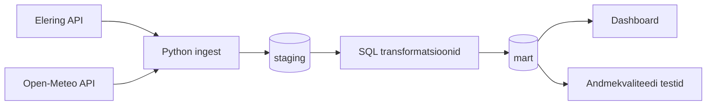

# Arhitektuur ja planeerimine (18.05–24.05)

## Reposid
- Kursuse infoallikas: `https://github.com/KristoR/ut-andmeinseneeria-2026`
- Projekti töörepo: `https://github.com/sirja-hass/Elektritarbimise_optimeerimine_kasvuhoones`

## 1) Äriküsimus
Millistel tundidel on kasvuhoones vaja kasutada elektrit nõudvaid seadmeid (küte ja ventilatsioon), arvestades hinnangulist sisetemperatuuri, ning kui palju väiksem on hinnanguline elektrikulu võrreldes olukorraga, kus seade töötaks kogu päeva jooksul pidevalt?

## 2) Mõõdikud (2–3) ja arvutusloogika
1. **Kütte- ja ventilatsioonitundide arv päevas**  
Arvutusloogika: Iga tunni kohta arvutatakse: hinnanguline_sisetemp = välistemp + 5°C. Kui hinnanguline sisetemperatuur on alla 12°C, siis märgitakse tund küttevajadusega tunniks. Kui hinnanguline sisetemperatuur on üle 28°C, siis märgitakse tund ventilatsioonivajadusega tunniks. Muul juhul märgitakse tegevuseks “none”. Päevane mõõdik näitab, mitu tundi oli vaja kütta, ventileerida või mitte sekkuda.

2. ****Keskmine elektrihind reeglipõhise kasutuse tundidel võrreldes päeva keskmise hinnaga** **  
   Arvutusloogika: Arvutatakse nende tundide keskmine elektrihind, kus küte või ventilatsioon oli vajalik. Seda võrreldakse kogu päeva keskmise elektrihinnaga. See näitab, kas kasvuhoone kasutusvajadus langeb pigem odavamale või kallimale elektriajale ning kui soodne või ebasoodne on elektrikulu kujunemine antud ilmatingimustes.

3. **Hinnanguline päevane elektrikulu reeglipõhises kasutuses vs pidev kasutus**  
  Arvutusloogika: Reeglipõhise kasutuse korral eeldatakse, et seade töötab ainult nendel tundidel, kus küte või ventilatsioon on vajalik. Pideva kasutuse korral eeldatakse, et seade töötab kõik 24 tundi sõltumata temperatuurist. Iga töötunni kulu arvutatakse: seadme tarbimine kWh × selle tunni elektrihind €/kWh.
Kuna Eleringi hind on kujul €/MWh, teisendatakse see enne arvutust: €/kWh = €/MWh / 1000. Päeva lõpuks summeeritakse tunnikulud. Kahe tulemuse vahe näitab hinnangulist päevast säästu.

## 3) Lihtsustusmudel (baastase)
Kuna kasvuhoone sisetemperatuuri sensor ja seadme tegelik energaitarbimine puuduvad, siis kasutatakse järgmisi hinnanguid:

`hinnanguline_sisetemp = välistemp + 5°C`
`keskmine_seadme_elektri_tarbimine_per_tund = 5kW`
Eeldus: pideva elektri tarbimise puhul tähendab, et seade töötab kõigl 24 tunnil ja mõlemat seadet korraga ei kasutata.  

Reeglid:
- `hinnanguline_sisetemp < 12°C` → **küte vajalik**
- `hinnanguline_sisetemp > 28°C` → **ventilatsioon vajalik**
- muidu → **temperatuur sobiv**

Mudelit kasutatakse demonstratsiooniks ning tegemist ei ole täpse agronoomilise simulatsiooniga.

## 4) Andmeallikad ja muutuvus
1. **Elering NPS API (`/api/nps/price`)**  
   - Andmetüüp: elektri spot-hind tunni kaupa (Eesti piirkond).  
   - Ajas muutuvus: Nord Pool day-ahead hinnad avaldatakse üldiselt kord päevas (järgmise päeva 24 tundi).  
   - Kasutus projektis: hinnapõhiste tegevustundide ja kulu võrdlus.

2. **Open-Meteo Forecast API**  
   - Andmetüüp: tunnipõhine välistemperatuuri prognoos (ja vajadusel lisatunnused).  
   - Ajas muutuvus: prognoosiväärtused uuenevad regulaarselt (mitu korda päevas; päringut teeme pipeline jooksu ajal, vaikimisi iga tunni alguses croniga).  
   - Kasutus projektis: sisetemperatuuri hinnangu alus.

3. **Staatiline dimensioon (`scripts/00_seed_dimensions.sql`)**  
   - Andmetüüp: 5 Eesti asula kirjeldus (`mart.dim_location`).  
   - Ajas muutuvus: käsitsi hallatav seed; muutub ainult siis, kui uuendame asulate loetelu.

## 5) Andmevoog (Mermaid)

## 6) Tööjaotus (4 liiget)
1. **Liige A – Ingest & ajastus**
Vastutab andmete sissevõtu eest:
- API ühendused (Open-Meteo + Elering)
- .env ja konfiguratsiooni seadistus
- run_pipeline.py ingest loogika
- andmete laadimine staging kihti
- cron/scheduler automaatne käivitamine
2. **Liige B – Andmemudel & transformatsioon**
  - 01_transform.sql
- otsuseloogika (sisetemperatuur = välistemp + 5°C)
- kütte ja ventilatsiooni reeglid
- hinnainfo sidumine transformatsioonis
- mart kiht
3. **Liige C – Andmekvaliteet**
   - 02_quality_tests.sql
- 03_check_results.sql
- kvaliteedireeglid:
  - price_eur_mwh NOT NULL
  - temperatuuri vahemikud
  - run+location+time unikaalsus
4. **Liige D – Dashboard & esitlus**
  - dashboard/app.py
- KPI visualiseerimine
- README viimistlus
- demo ja esitlus

## 7) Riskid (realistlikud)
1. **Hinnainfo ulatusrisk:** Eleringi day-ahead hinnad katavad praktiliselt tänase/homse vaate; liiga pikk prognoosiaken tekitab tunde, kus ilm on olemas, kuid hind puudub.  
   Leevendus: kasutada otsustusakent `FORECAST_DAYS=2` ja filtreerida transformis read, kus hind puudub.

2. **Ajavööndi joondusrisk:** API-d võivad tagastada aegu erinevas formaadis/ajavööndis; vale joondus rikub tunni-põhise joini.  
   Leevendus: normaliseerida ajad ühte ajavööndisse (UTC või Europe/Tallinn) ingestis ja kontrollida joini testpäringutega.

3. **Andmekvaliteedi risk:** vigased või puuduvad väärtused (`NULL` hind, ebatõenäoline temperatuur, duplikaadid) moonutavad soovitusi.  
   Leevendus: käivitada quality testid igal pipeline jooksul ja katkestada “success” raport, kui testid kukuvad läbi.

## 8) Privaatsus ja turve
- API võtmeid ega paroole ei hoita koodis.
- Keskkonnamuutujad hoitakse `.env` failis (lokaalne, `.gitignore` all).
- Repos hoitakse ainult `.env.example`, et tiim näeks vajalikke võtmenimesid ilma salajasi väärtusi jagamata.
- Kui lisanduvad tööandja andmed, kasutatakse anonüümseid/sünteetilisi näidiseid avalikus repos.

## 9) Nädala väljundid
- `docs/arhitektuur.md` valmis.
- API-de testpäringud tehtud.
- Rollid ja esmane tehniline plaan paigas.
