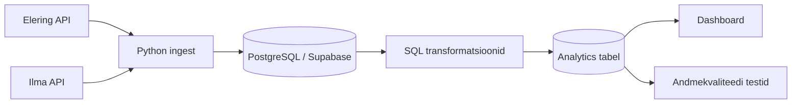

# Arhitektuur ja planeerimine (18.05–24.05)

## Reposid
- Kursuse infoallikas: `https://github.com/KristoR/ut-andmeinseneeria-2026`
- Projekti töörepo: `https://github.com/sirja-hass/Elektritarbimise_optimeerimine_kasvuhoones`

## 1) Äriküsimus
Millistel tundidel tasub kasvuhoones kasutada elektrit nõudvaid seadmeid (küte, ventilatsioon), et vähendada elektrikulu börsihinna tingimustes, arvestades välistemperatuuri?

## 2) Mõõdikud (2–3)
1. **Soovitatud tunnid kütte ja ventilatsiooni kasutamiseks.**
2. **Keskmine spot-hind soovitatud tundidel** vs päeva keskmine spot-hind.
3. **Hinnanguline päevane kulu** (€) reeglipõhise juhtimise korral.

## 3) Lihtsustusmudel (baastase)
Kuna sisetemperatuuri sensorit ei kasutata, arvutame hinnangu:

`hinnanguline_sisetemp = välistemp + 5°C`

Reeglid:
- `hinnanguline_sisetemp < 12°C` → **küte vajalik**
- `hinnanguline_sisetemp > 28°C` → **ventilatsioon vajalik**
- muidu → **temperatuur sobiv**

Mudelit kasutatakse demonstratsiooniks ning tegemist ei ole täpse agronoomilise simulatsiooniga.

## 4) Andmeallikad ja muutuvus
- **Elektri spot-hind (API):** tunnipõhine, muutub ajas (põhiandmevoog).
- **Ilmaandmed (API):** tunnipõhine prognoos/ajalooline välistemperatuur + päikesekiirgus (põhiandmevoog).
- **Staatilised kõrvalandmed (vajadusel):** seadmete nimivõimsused (CSV seed), et arvutada kulu.

## 5) Arhitektuuriskeem (Mermaid)

## 6) Tööjaotus (4 liiget)
1. **Liige A – Ingest & ajastus**
   - API connectorid (hind + ilm), `.env` seadistus, ajastus.
2. **Liige B – Andmemudel & transformatsioon**
   - Bronze/Silver/Gold mudelid, joinid, reeglite rakendus.
3. **Liige C – Andmekvaliteet**
   - Testid:
     - elektrihind ei tohi olla NULL
     - temperatuur peab jääma mõistlikku vahemikku
     - tunnikirjed peavad olema unikaalsed
4. **Liige D – Dashboard & esitlus**
   - KPI visualid, README viimistlus, demo-video.

## 7) Riskid (2–3)
1. API katkestused või päringupiirangud (rate limit).
2. Ajavööndite vastuolu (UTC vs Europe/Tallinn) tunniandmete joinimisel.
3. API andmete puudumine või vigased tunnikirjed.

## 8) Nädala väljundid
- `docs/arhitektuur.md` valmis.
- API-de testpäringud tehtud.
- Rollid ja esmane tehniline plaan paigas.