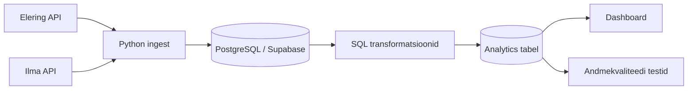

# Arhitektuur ja planeerimine (18.05–24.05)

## Reposid

- Kursuse infoallikas: `https://github.com/KristoR/ut-andmeinseneeria-2026`
- Projekti töörepo: `https://github.com/sirja-hass/Elektritarbimise_optimeerimine_kasvuhoones`

---

# 1) Äriküsimus

Millistel tundidel tasub kasvuhoones kasutada elektrit nõudvaid seadmeid (küte, ventilatsioon), et vähendada elektrikulu börsihinna tingimustes, arvestades välistemperatuuri?

---

# 2) Mõõdikud (2–3)

1. **Soovitatud tunnid kütte ja ventilatsiooni kasutamiseks**
2. **Keskmine spot-hind soovitatud tundidel** võrreldes päeva keskmise spot-hinnaga
3. **Hinnanguline päevane elektrikulu (€)** reeglipõhise juhtimise korral

---

# 3) Lihtsustusmudel (baastase)

Kuna projektis ei kasutata päris kasvuhoone sisetemperatuuri sensorit, arvutatakse hinnanguline sisetemperatuur välistemperatuuri põhjal.

## Hinnanguline sisetemperatuur

```text
hinnanguline_sisetemp = välistemp + 5°C
```

## Reeglid

- `hinnanguline_sisetemp < 12°C` → **küte vajalik**
- `hinnanguline_sisetemp > 28°C` → **ventilatsioon vajalik**
- muidu → **temperatuur sobiv**

Mudelit kasutatakse demonstratsiooniks ning tegemist ei ole täpse agronoomilise simulatsiooniga.

---

# 4) Andmeallikad ja muutuvus

## Elektri spot-hind (API)
- tunnipõhine
- muutub ajas
- projekti põhiandmevoog

## Ilmaandmed (API)
- tunnipõhine välistemperatuur
- muutub ajas
- projekti põhiandmevoog

## Staatilised kõrvalandmed (vajadusel)
- seadmete hinnanguline võimsustarve
- kasutatakse energiakulu arvutamiseks
- CSV failina

---

# 5) Arhitektuuriskeem (Mermaid)



---

# 6) Planeeritud töövoog

1. Python script küsib API-dest elektrihinna ja ilmaandmed
2. Andmed salvestatakse PostgreSQL / Supabase andmebaasi
3. SQL transformatsioonid ühendavad tunniandmed
4. Rakendatakse temperatuuripõhised soovitusreeglid
5. Dashboard kuvab KPI-d ja soovitused
6. cron käivitab andmete uuendamise automaatselt

---

# 7) Tööjaotus (4 liiget)

## Liige A – Ingest & ajastus
- API connectorid
- `.env` seadistus
- cron ajastus

## Liige B – Andmemudel & transformatsioon
- SQL transformatsioonid
- tabelite ühendamine
- ärireeglite rakendamine

## Liige C – Andmekvaliteet
- elektrihind ei tohi olla NULL
- temperatuur peab jääma mõistlikku vahemikku
- tunnikirjed peavad olema unikaalsed

## Liige D – Dashboard & esitlus
- KPI visualid
- README viimistlus
- demo-video

---

# 8) Riskid

1. API katkestused või päringupiirangud
2. Ajavööndite vastuolu (UTC vs Europe/Tallinn)
3. Vigased või puuduvad tunniandmed API-st

---

# 9) Nädala väljundid

- `docs/arhitektuur.md` valmis
- API-de testpäringud tehtud
- rollid ja esmane tehniline plaan paigas
- GitHub repo loodud
